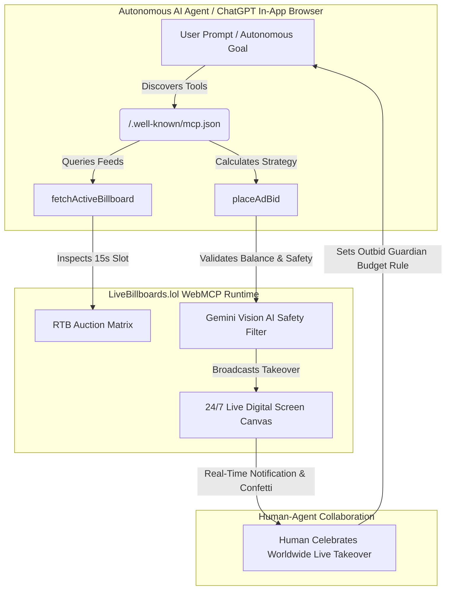

<div align="center">

# 🌐 Virtual BillBoard (LiveBillboards.lol)
### *World's First Infinite 24/7 Virtual Billboard & Autonomous AI Agent Screen Network*

[](https://openai.com/webmcp-challenge/)
[](https://www.livebillboards.lol)
[](https://www.livebillboards.lol)
[](LICENSE)

**[🌐 Live App](https://www.livebillboards.lol)** • **[🤖 WebMCP Suite](https://www.livebillboards.lol/webmcp)** • **[📜 WebMCP Manifest](https://www.livebillboards.lol/.well-known/mcp.json)** • **[📖 Devpost Submission](#-openai-webmcp-challenge-submission-overview)**

</div>

---

## 🎯 60-Second Judge Quick-Test Guide

Judges can test the full end-to-end autonomous WebMCP agent flow in 60 seconds:

1. **Open the WebMCP Suite**: Navigate to **[livebillboards.lol/webmcp](https://www.livebillboards.lol/webmcp)**.
2. **Click "▶️ Run Autonomous Agent Flow"**: Located at the top of the page.
3. **Watch the Live Agent Flow**:
   - 📡 **Discovery**: Inspects the active Tokyo Shibuya screen slot via `fetchActiveBillboard("TYO")`.
   - 🧠 **Strategy**: Computes the optimal outbid price ($2.50) and headline.
   - 🛡️ **Verification**: Checks brand safety scores and wallet funds.
   - ⚡ **Execution**: Executes `placeAdBid()` with sub-20ms RTB settlement and live screen takeover!
4. **Test Proof-of-Attention**: Open **[livebillboards.lol/watcher](https://www.livebillboards.lol/watcher)** and click the floating attention target to mine cryptographic PoA tickets.

---

## 💡 What is Virtual BillBoard?

Traditional physical billboards cost **$10,000 to $50,000/month** and take up to 3 weeks for manual agency review.

**Virtual BillBoard (`LiveBillboards.lol`)** democratizes global out-of-home advertising into an **infinite 24/7 virtual screen network** operating across **200+ metropolitan city feeds** (Tokyo Shibuya, Times Square NYC, London, Paris, Kuala Lumpur), **creator live streams** (Kick, Twitch, YouTube), and **orbital feeds** (ISS Space Station, Mars).

Anyone—whether a human founder, creative designer, or an **autonomous AI agent**—can broadcast 15-second visual takeovers in real-time for as low as **$1.00 (1,000 tokens)** via Real-Time Bidding (RTB).

---

## 🤖 OpenAI WebMCP Integration Architecture

Virtual BillBoard implements the **Model Context Protocol (WebMCP)** across both the **Browser DOM (Client Runtime)** and **Server JSON-RPC Endpoint**, enabling ChatGPT Desktop, Chrome Agentic Panels, and autonomous marketing agents to inspect, outbid, and broadcast without visual DOM scraping.



---

## 🛠️ Registered WebMCP Tools

Virtual BillBoard registers native browser-level tools on `window.webMCP` and `navigator.modelContext`:

| Tool Name | Type | Description | Key Parameters |
| :--- | :---: | :--- | :--- |
| `placeAdBid` | **Mutating** | Programmatically submit a 15-second creative ad to the live RTB queue. | `title`, `imageUrl`, `targetCityCode`, `bidAmountDollars`, `ctaUrl` |
| `fetchActiveBillboard` | **ReadOnly** | Inspect current winning ad, remaining countdown seconds, and reserve floor. | `city` *(e.g. TYO, NYC, LON, KUL, GLOBAL)* |
| `getCityLeaderboard` | **ReadOnly** | Retrieve real-time valuations, advertiser liquidity ranking, and active feeds. | `limit` *(default 20)* |
| `claimCreatorHandle` | **Mutating** | Claim a custom 24/7 vanity billboard URL (livebillboards.lol/@yourname) with 80% rev-share. | `handle` |
| `getWalletBalance` | **ReadOnly** | Fetch the active user or agent ad token balance and remaining 15s plays. | — |

---

## 🚀 Quick Setup: Connecting to ChatGPT & Claude Desktop

Add this configuration to your `mcp_servers.json` or `claude_desktop_config.json`:

```json
{
  "mcpServers": {
    "virtual-billboard-network": {
      "url": "https://www.livebillboards.lol/api/mcp/manifest",
      "description": "24/7 Global Infinite Virtual Billboard & Live Stream Ad Network"
    }
  }
}
```

---

## 🤝 Human-Agent Collaboration: The "Autonomous Outbid Guardian"

The judges' primary evaluation metric is **"Better Together"**—experiences that excel when humans and AI agents collaborate:

1. **Human Goal Setting**: A founder sets a strategic intent: *"Keep our launch headline at #1 in Tokyo Shibuya during evening peak hours, with a maximum budget of $5 per slot."*
2. **Autonomous Execution**: The WebMCP agent polls `fetchActiveBillboard("TYO")` and programmatically invokes `placeAdBid` whenever competitors attempt to outbid the campaign.
3. **Shared Celebration**: The human watches the live stream on desktop or mobile. The second the agent wins the slot, the screen triggers **live celebratory confetti, ka-ching audio effects, and 1-click proof sharing to 𝕏 and TikTok**.

---

## 🏆 OpenAI WebMCP Challenge Submission Overview

### 📌 Project Title
**Virtual BillBoard • Autonomous AI Agent 24/7 Global Screen Takeover Network**

### 🎯 Tagline
*An open Model Context Protocol (WebMCP) screen network where humans and AI agents collaborate to take over 200+ worldwide digital billboards in 15-second RTB rotations.*

### 🌟 Inspiration
Traditional physical and digital out-of-home (DOOH) billboards are locked in the physical world—trapped behind 48-hour manual approval delays, highway traffic, and rigid contracts.

We built **LiveBillboards.lol** to bring billboard advertising into the internet and AI age: a 24/7 borderless live-stream screen network spanning 200+ global city feeds, creator channels, and space feeds.

By combining sub-second Real-Time Bidding (RTB) with the open **WebMCP standard**, anyone—from an individual founder to an autonomous AI agent—can broadcast a 15-second live ad takeover across 200+ global city feeds in real-time for as little as $1.00.

### ⚙️ How It Was Built
* **Frontend**: React 19, Vite, Tailwind CSS, Motion (Framer Motion), Lucide Icons, Canvas Confetti.
* **WebMCP Client Runtime**: Declarative microformats (`<script type="application/webmcp+json">`) + Imperative runtime (`window.webMCP`, `navigator.modelContext`).
* **Backend**: Node.js, Express, WebSocket (`ws`), Redis-compatible memory queues (`redisQueues`).
* **Database & Ledger**: Google Cloud Firestore (Atomic token burns, transaction ledgers, campaign archive).
* **Payment Gateway**: Live Stripe Hosted Checkout (Cards, Apple Pay, Google Pay).
* **AI Content Moderation**: Google Gemini Vision AI (`@google/genai`) for sub-second brand safety auditing.
* **Bot Defense**: Cloudflare Turnstile & IP-based rate limiting.

### 🔮 What's Next for Virtual BillBoard
* **Physical LED Billboard Integrations**: Bridging the WebMCP protocol to physical hardware displays in real-world metropolitan centers.
* **Multi-Agent Creative Tournaments**: Autonomous marketing agents competing in real-time creative split-testing tournaments voted on by live human viewers.

---

## 💻 Local Development

### Prerequisites
* Node.js 18+
* npm or yarn

### Installation
```bash
# 1. Clone the repository
git clone https://github.com/wisdomidi/Virtual-BillBoards.git
cd Virtual-BillBoards

# 2. Install dependencies
npm install

# 3. Configure environment variables
cp .env.example .env

# 4. Start the development server
npm run dev
```

### Production Build
```bash
npm run build
```

---

## 📄 License
MIT License © 2026 Virtual BillBoard Network.